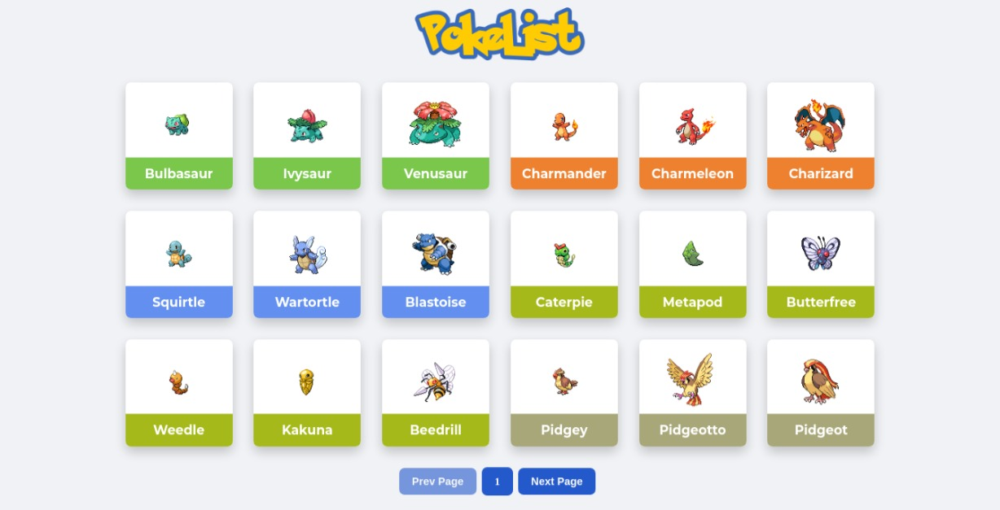

# PokeList app
## developed by [Darlon Henrique](https://github.com/darlonhenrique) with ☕


Application made with:
- React 
- Typescript 
- Next 
- Pokenode-ts api 
- Styled-Components 

How to Run:
1. Download or Clone Repostirory 
2. Open In Your Code Editor
3. Run ```npm install or yarn install``` to install the dependencies
4. Run ```npm run dev or yarn run dev``` to execute project in your localhost
5. Access http://localhost:3000/ to view the project
